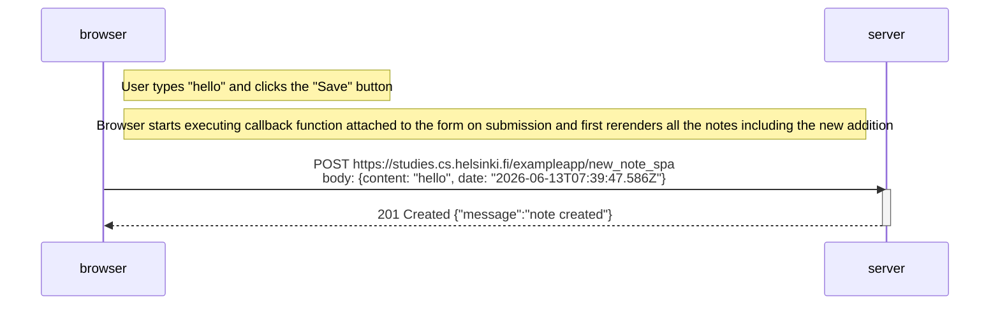

```mermaid
sequenceDiagram
    participant browser
    participant server

    Note right of browser: User types "hello" and clicks the "Save" button
    Note right of browser: Browser starts executing callback function attached to the form on submission and first rerenders all the notes including the new addition
    browser->>server: POST https://studies.cs.helsinki.fi/exampleapp/new_note_spa <br> body: {content: "hello", date: "2026-06-13T07:39:47.586Z"}
    activate server
    server-->>browser: 201 Created {"message":"note created"}
    deactivate server
```